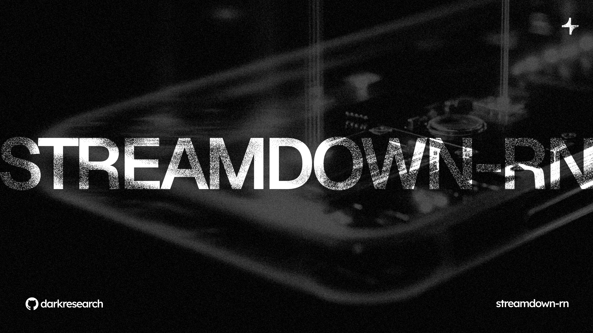

# streamdown-rn

[](https://www.npmjs.com/package/streamdown-rn)

A React Native streaming markdown renderer based on [Vercel's Streamdown](https://github.com/vercel/streamdown), with powerful enhacements for more dynamic AI applications.

streamdown-rn is designed to be mobile native and to have feature parity with streamdown, then adds one additional standout feature: **dynamic component injection.**

Dynamic component injection gives LLMs the ability to use arbitrary React Native components that are curated through an external registry, turning an AI chat interface into a dynamically generated UI.

## What makes streamdown-rn different?

streamdown-rn brings Vercel's streaming markdown philosophy to React Native, plus a powerful innovation that streamdown doesn't have:

**🎯 Dynamic component injection**:
- Supports **arbitrary React Native components** supplied through an external registry
- LLMs can inject any registered component directly into markdown responses
- Runtime component validation with JSON schemas
- Turn chat into a **programmable UI platform** where AI composes complex, interactive interfaces on the fly
- Example: AI renders a `TokenCard`, `Chart`, or any custom component right in the response


**Importantly:** Rather than requiring rigid rendering logic on the client side to render these UI components (which would mean your client side code gets more complicated with each additional component), streamdown-rn gives your LLM a flexible, generic interface through which it chooses to use and saturates the props of UI components when it deems best.

Of course, mobile and streaming come standard:

**📱 Mobile-first** - Built specifically for React Native:
- StyleSheet-based theming (not CSS)
- Optimized for touch interfaces
- Cross-platform (iOS, Android, Web)

**🚀 Streaming-first** - Just like Vercel's streamdown:
- Handles incomplete markdown gracefully
- Smooth real-time rendering during AI responses
- Optimized for rapid text updates

## Features

🎯 **Dynamic component injection** - Supports arbitrary React Native components via external registry  
🔄 **Progressive field rendering** - Components render field-by-field as data streams in (75% faster perceived performance!)  
🎨 **Declarative skeleton framework** - `<Progressive>` component for elegant field-level loading states  
🚀 **Streaming-first** - Handles incomplete markdown gracefully during AI response streaming  
📱 **Mobile-optimized** - Built specifically for React Native performance  
🎨 **Themeable** - Built-in dark/light theme support with StyleSheet  
💻 **Syntax highlighting** - Beautiful code blocks with copy-to-clipboard  
📊 **Table support** - Horizontal scrolling for mobile  
⚡ **Performance optimized** - Memoized rendering, streaming optimization, component caching  
🎛️ **Style overrides** - Deep merge custom styles with theme styles  
🛡️ **Error handling** - Component error callbacks for graceful failures  
📦 **Compact syntax** - Short keys (`c`, `p`) and prop names for faster streaming

## Why streamdown-rn?

Traditional markdown renderers break down when you stream incomplete content from AI models - Vercel's streamdown solvd this for React. streamdown-rn brings the same elegance to React Native, allowing LM sto compose rich, interactive UIs directly in markdown responses.

## Installation

```bash
bun add streamdown-rn
```

Or with npm/yarn:
```bash
npm install streamdown-rn
# or
yarn add streamdown-rn
```

## Usage

### Basic usage

```typescript
import { StreamdownRN } from 'streamdown-rn';

const MyComponent = ({ content }) => (
  <StreamdownRN theme="dark">
    {content}
  </StreamdownRN>
);
```

### With component registry

```typescript
import { StreamdownRN } from 'streamdown-rn';
import { View } from 'react-native';

// Your component registry (see Component Registry Setup below)
const componentRegistry = createComponentRegistry();

const AssistantMessage = ({ content }) => (
  <View style={styles.assistantRow}>
    <StreamdownRN 
      componentRegistry={componentRegistry}
      theme="dark"
      onComponentError={(error) => console.warn('Component error:', error)}
    >
      {content}
    </StreamdownRN>
  </View>
);
```

### Component injection - the killer feature

This is streamdown-rn's standout feature - something Vercel's streamdown doesn't have. Your AI can inject **arbitrary React Native components** directly into markdown responses:

```markdown
Here's some **bold text** and a dynamic component:

{{c:"TokenCard",p:{"sym":"BTC","name":"Bitcoin","price":45000,"change":2.5}}}

More markdown content continues...
```

**Compact syntax**: Components use short keys (`c` for component, `p` for props) and short prop names for faster streaming and better LLM efficiency.

This turns your chat interface into a **programmable UI platform** where the LLM composes complex, interactive interfaces on the fly. Any component you register can be injected by the AI.

### Component registry setup

To enable component injection, you need to create and provide a component registry. Here's how:

```typescript
import { ComponentRegistry, ComponentDefinition, ComponentRenderingMetadata } from 'streamdown-rn';
import { Progressive } from 'streamdown-rn';
import { TokenCard } from './components/TokenCard';
import { Chart } from './components/Chart';

// Define your components with JSON schemas, descriptions, and progressive rendering metadata
const components: ComponentDefinition[] = [
  {
    name: 'TokenCard',
    component: TokenCard,
    category: 'dynamic',
    description: 'Displays token information with progressive field rendering',
    propsSchema: {
      type: 'object',
      properties: {
        sym: { type: 'string', description: 'Token symbol (e.g., BTC, ETH)' },
        name: { type: 'string', description: 'Full token name (e.g., Bitcoin)' },
        price: { type: 'number', description: 'Current price in USD' },
        change: { type: 'number', description: '24h price change percentage' }
      },
      required: ['sym', 'name']
    },
    renderingMetadata: {
      fieldOrder: ['sym', 'name', 'price', 'change'] // Render priority during streaming
    }
  },
  {
    name: 'Chart',
    component: Chart,
    category: 'dynamic',
    description: 'Renders a chart with progressive rendering',
    propsSchema: {
      type: 'object',
      properties: {
        data: { type: 'array', description: 'Chart data points' },
        type: { type: 'string', description: 'Chart type', enum: ['line', 'bar', 'pie'] }
      },
      required: ['data', 'type']
    },
    renderingMetadata: {
      fieldOrder: ['type', 'data']
    }
  }
];

// Create registry implementation
function createComponentRegistry(): ComponentRegistry {
  const componentMap = new Map(components.map(c => [c.name, c]));
  
  return {
    get(name: string) {
      return componentMap.get(name);
    },
    has(name: string) {
      return componentMap.has(name);
    },
    validate(name: string, props: any) {
      const def = componentMap.get(name);
      if (!def) {
        return { valid: false, errors: [`Component '${name}' not found`] };
      }
      
      // Simple validation - you can use ajv or similar for full JSON Schema validation
      const schema = def.propsSchema;
      const errors: string[] = [];
      
      if (schema.required) {
        for (const field of schema.required) {
          if (!(field in props)) {
            errors.push(`Missing required field: ${field}`);
          }
        }
      }
      
      return {
        valid: errors.length === 0,
        errors
      };
    }
  };
}

// Use it
const registry = createComponentRegistry();

<StreamdownRN componentRegistry={registry}>
  {markdownContent}
</StreamdownRN>
```

### Progressive rendering components

streamdown-rn includes a declarative framework for building components that render **field-by-field** as data streams in. This dramatically improves perceived performance during streaming.

#### Building progressive components

Use the `<Progressive>` framework to create components that show skeletons for missing fields:

```typescript
import { Progressive, FieldSkeleton } from 'streamdown-rn';
import type { ThemeConfig } from 'streamdown-rn';

interface TokenCardProps {
  sym: string;
  name: string;
  price: number;
  change: number;
  _theme?: ThemeConfig; // Internal theme prop passed by StreamdownRN
}

export const TokenCard = (props: Partial<TokenCardProps>) => {
  const theme = props._theme || defaultTheme;
  
  return (
    <Progressive props={props} metadata={metadata} theme={theme}>
      <View style={styles.card}>
        <Progressive.Field name="sym" skeleton={{ width: 60, height: 22 }}>
          {(val) => <Text style={styles.symbol}>{val}</Text>}
        </Progressive.Field>
        
        <Progressive.Field name="name" skeleton={{ width: 100, height: 18 }}>
          {(val) => <Text style={styles.name}>{val}</Text>}
        </Progressive.Field>
        
        <Progressive.Field name="price" skeleton={{ width: 120, height: 28 }}>
          {(val) => <Text style={styles.price}>${val.toLocaleString()}</Text>}
        </Progressive.Field>
        
        <Progressive.Field name="change" skeleton={{ width: 70, height: 20 }}>
          {(val) => (
            <Text style={val >= 0 ? styles.positive : styles.negative}>
              {val >= 0 ? '+' : ''}{val.toFixed(2)}%
            </Text>
          )}
        </Progressive.Field>
      </View>
    </Progressive>
  );
};
```

**How it works:**
- As props stream in (`{sym:"BTC"}` → `{sym:"BTC",name:"Bitcoin"}` → ...), fields appear one by one
- Missing fields show animated skeleton placeholders
- Progressive.Field children can be ANY React component
- Skeleton dimensions should match the rendered component size

#### Streaming timeline example

With 10ms/character delay:

```
Stream position 0 (160ms):   {{c:"TokenCard"
Render:                      Empty TokenCard (all fields = skeletons)

Stream position 1 (250ms):   {{c:"TokenCard",p:{"sym":"BTC"}
Render:                      sym ✓ | name/price/change = skeletons

Stream position 2 (400ms):   ...,"name":"Bitcoin"}
Render:                      sym ✓ name ✓ | price/change = skeletons

Stream position 3 (550ms):   ...,"price":45000}
Render:                      sym ✓ name ✓ price ✓ | change = skeleton

Stream position 4 (650ms):   ...,"change":2.5}}}
Render:                      All fields complete ✓
```

**Result**: First visual feedback in 160ms instead of 650ms (75% faster perceived performance!)

### Custom themes and style overrides

```typescript
import { StreamdownRN, ThemeConfig } from 'streamdown-rn';

// Use built-in themes
<StreamdownRN theme="dark">
  {content}
</StreamdownRN>

<StreamdownRN theme="light">
  {content}
</StreamdownRN>

// Custom theme
const customTheme: ThemeConfig = {
  colors: {
    text: '#FFFFFF',
    background: '#000000',
    border: '#333333',
    link: '#4A9EFF',
    code: '#A7BEE6',
    codeBackground: '#101A29',
    blockquote: '#4A9EFF',
    strong: '#FFFFFF',
    emphasis: '#C7D2E8',
    // Skeleton colors for progressive rendering
    skeletonBase: '#1A1A1A',
    skeletonHighlight: '#2A2A2A',
    // Syntax highlighting colors
    syntaxKeyword: '#FF7B72',
    syntaxString: '#A5D6FF',
    syntaxNumber: '#79C0FF',
    syntaxComment: '#8B949E',
    syntaxFunction: '#D2A8FF',
    syntaxClass: '#FFA657',
    syntaxOperator: '#FF7B72',
    syntaxDefault: '#C9D1D9',
  },
  fonts: {
    body: 'Satoshi',
    code: 'Menlo',
    heading: 'Satoshi',
  },
  spacing: {
    paragraph: 12,
    heading: 16,
    list: 8,
    code: 12,
  },
};

<StreamdownRN theme={customTheme}>
  {content}
</StreamdownRN>

// Style overrides (deep merged with theme)
<StreamdownRN 
  theme="dark"
  styleOverrides={{
    paragraph: {
      fontSize: 18,
      lineHeight: 26,
    },
    heading1: {
      fontSize: 28,
    }
  }}
>
  {content}
</StreamdownRN>
```

## API reference

### StreamdownRN props

| Prop | Type | Default | Description |
|------|------|---------|-------------|
| `children` | `string` | - | The streaming markdown content |
| `componentRegistry` | `ComponentRegistry` | `undefined` | Optional component registry for dynamic components |
| `theme` | `'light' \| 'dark' \| ThemeConfig` | `'dark'` | Theme configuration |
| `styleOverrides` | `Partial<Record<string, any>>` | `undefined` | Style overrides (deep merged with theme styles) |
| `onComponentError` | `(error: ComponentError) => void` | `undefined` | Error handler for component failures |
| `style` | `ViewStyle` | `undefined` | Additional styling for the container |
| `onStateUpdate` | `(state: IncompleteTagState) => void` | `undefined` | Callback for incomplete tag state updates (dev/debugging) |
| `onComponentExtractionUpdate` | `(state: ComponentExtractionState) => void` | `undefined` | Callback for component extraction updates (dev/debugging) |

### Component syntax

Components use compact JSON syntax for efficient streaming:

```
{{c:"ComponentName",p:{"field1":"value1","field2":123}}}
```

**Syntax breakdown:**
- `{{c:"Name",p:{...}}}` - Component wrapper
- `c` - Component key (short for "component")
- `p` - Props key (short for "props")
- Props use standard JSON with quoted keys
- Field names should be short (e.g., `sym` not `tokenSymbol`)

**Why compact syntax?**
- **Faster streaming**: ~50% fewer characters = faster LLM generation
- **Lower latency**: Less data to stream = quicker time-to-first-render
- **Better UX**: Progressive rendering kicks in sooner

### Component registry interface

```typescript
interface ComponentRegistry {
  get(name: string): ComponentDefinition | undefined;
  validate(name: string, props: any): ValidationResult;
  has(name: string): boolean;
}

interface ComponentDefinition {
  name: string;
  component: ComponentType<any>;
  category: 'dynamic';
  description?: string;
  propsSchema: JSONSchema;
  examples?: any[];
  renderingMetadata?: ComponentRenderingMetadata;
}

interface ComponentRenderingMetadata {
  fieldOrder?: string[]; // e.g., ['sym', 'name', 'price', 'change'] - render priority
}

interface ValidationResult {
  valid: boolean;
  errors: string[];
}
```

### Exported utilities

streamdown-rn exports several utilities for advanced use cases:

#### Markdown processing utilities

```typescript
import { 
  fixIncompleteMarkdown,
  isMarkdownIncomplete,
  sanitizeMarkdown,
  optimizeForStreaming
} from 'streamdown-rn';

// Fix incomplete markdown patterns
const fixed = fixIncompleteMarkdown('**bold text'); // Returns '**bold text**'

// Check if markdown is incomplete
const incomplete = isMarkdownIncomplete('**bold text'); // Returns true

// Sanitize markdown for safe rendering
const safe = sanitizeMarkdown(markdown);

// Optimize for streaming (handles long content efficiently)
const optimized = optimizeForStreaming(longMarkdown);
```

#### Component utilities

```typescript
import {
  extractComponents,
  extractPartialComponents,
  injectComponentPlaceholders,
  validateComponentSyntax,
  getComponentStats,
  getLastJSONCleanup
} from 'streamdown-rn';

// Extract complete components from markdown
const { markdown, components } = extractComponents(
  markdownWithComponents,
  componentRegistry
);

// Extract partial components (incomplete but parseable props)
const { markdown: md, components: partials } = extractPartialComponents(
  markdownWithComponents,
  componentRegistry
);

// Get last JSON cleanup details (debugging)
const cleanupInfo = getLastJSONCleanup();
// Returns: { original: string, final: string, steps: JSONCleanupStep[], success: boolean, error?: string }

// Validate component syntax without processing
const validation = validateComponentSyntax(markdown);
// Returns: { valid: boolean, errors: string[], components: string[] }

// Get component statistics
const stats = getComponentStats(markdown);
// Returns: { totalComponents: number, uniqueComponents: string[], componentCounts: Record<string, number> }
```

#### Progressive rendering components

```typescript
import { Progressive, FieldSkeleton } from 'streamdown-rn';

// Progressive wrapper for field-by-field rendering
<Progressive props={partialProps} metadata={metadata} theme={theme}>
  <Progressive.Field name="fieldName" skeleton={{ width: 100, height: 20 }}>
    {(value) => <YourComponent value={value} />}
  </Progressive.Field>
</Progressive>

// Standalone field skeleton for custom layouts
<FieldSkeleton 
  width={80} 
  height={16} 
  borderRadius={4}
  theme={theme}
/>
```

#### Theme exports

```typescript
import {
  darkTheme,
  darkMarkdownStyles,
  lightTheme,
  lightMarkdownStyles
} from 'streamdown-rn';

// Use theme configs
const theme = darkTheme;

// Use pre-styled markdown styles
const styles = darkMarkdownStyles;
```

#### TypeScript types

All TypeScript interfaces are exported:

```typescript
import type {
  StreamdownRNProps,
  ComponentRegistry,
  ComponentDefinition,
  ComponentInstance,
  ProcessedMarkdown,
  ComponentError,
  ThemeConfig,
  ValidationResult,
  JSONSchema,
  ComponentRenderingMetadata,
  ComponentExtractionState,
  JSONCleanupStep,
} from 'streamdown-rn';
```

## Streaming features

### Incomplete markdown handling

streamdown-rn automatically fixes common incomplete markdown patterns during streaming:

- **Unclosed bold**: `**bold text` → `**bold text**`
- **Unclosed italic**: `*italic text` → `*italic text*`
- **Unclosed code**: `` `code text`` → `` `code text` ``
- **Unclosed code blocks**: ````javascript\ncode``` → ````javascript\ncode\n````
- **Unclosed links**: `[text](url` → `[text](url)`
- **Incomplete lists**: Proper spacing and formatting
- **Incomplete headings**: Proper spacing and formatting
- **Incomplete components**: Hides incomplete `{{component:...}}` syntax until complete

### Performance optimization

- **Memoized processing** - Prevents unnecessary re-renders
- **Streaming optimization** - Efficient handling of rapid text updates (processes only recent changes for long content)
- **Progressive rendering** - Components appear field-by-field, reducing perceived latency by 75%+
- **Intelligent JSON parsing** - Auto-completes incomplete JSON during streaming
- **Component caching** - Reuses validated components
- **Memory management** - Optimized for long chat sessions

## Progressive Rendering Guide

### Why progressive rendering?

Traditional component rendering waits for ALL data before showing anything. With streaming, this creates unnecessary delays:

**Without progressive rendering:**
```
{{c:"TokenCard",p:{"sym":"BTC","name":"Bitcoin","price":45000,"change":2.5}}}
                                                                          ^^^
                                                    User waits 760ms to see anything
```

**With progressive rendering:**
```
{{c:"TokenCard"           → Empty component (all fields = skeletons) at 160ms
...p:{"sym":"BTC"}        → Symbol appears at 250ms
...,"name":"Bitcoin"}     → Name appears at 400ms
...,"price":45000}        → Price appears at 550ms
...,"change":2.5}}}       → Change appears at 650ms (complete!)
```

**Result**: Visual feedback starts 75% sooner, creating a much smoother streaming experience.

### Building progressive components

#### 1. Use short prop names

```typescript
// ❌ Old way (verbose)
interface TokenCardProps {
  tokenSymbol: string;
  tokenName: string;
  tokenPrice: number;
  priceChange24h: number;
}

// ✅ New way (compact)
interface TokenCardProps {
  sym: string;   // Token symbol
  name: string;  // Full name
  price: number; // Current price
  change: number; // 24h change %
}
```

#### 2. Use the Progressive framework

```typescript
import { Progressive } from 'streamdown-rn';

export const TokenCard = (props: Partial<TokenCardProps>) => {
  const theme = props._theme || defaultTheme;
  
  return (
    <Progressive props={props} metadata={metadata} theme={theme}>
      <View style={styles.card}>
        {/* Each field shows value or skeleton */}
        <Progressive.Field name="sym" skeleton={{ width: 60, height: 22 }}>
          {(val) => <Text style={styles.symbol}>{val}</Text>}
        </Progressive.Field>
        
        <Progressive.Field name="name" skeleton={{ width: 100, height: 18 }}>
          {(val) => <Text style={styles.name}>{val}</Text>}
        </Progressive.Field>
        
        {/* Fields can render ANY React component */}
        <Progressive.Field name="price" skeleton={{ width: 120, height: 28 }}>
          {(val) => <PriceDisplay value={val} />}
        </Progressive.Field>
      </View>
    </Progressive>
  );
};
```

#### 3. Define rendering metadata

```typescript
const metadata: ComponentRenderingMetadata = {
  fieldOrder: ['sym', 'name', 'price', 'change'] // Render priority
};
```

#### 4. Register with schema descriptions

```typescript
{
  name: 'TokenCard',
  component: TokenCard,
  category: 'dynamic',
  propsSchema: {
    type: 'object',
    properties: {
      sym: { type: 'string', description: 'Token symbol (BTC, ETH)' },
      name: { type: 'string', description: 'Full token name (Bitcoin)' },
      price: { type: 'number', description: 'Current price USD' },
      change: { type: 'number', description: '24h change %' }
    }
  },
  renderingMetadata: metadata
}
```

The `description` fields help LLMs understand what each short prop name means.

### Best practices

1. **Keep prop names short** - Faster streaming, better LLM token efficiency
2. **Match skeleton sizes** - Prevent layout shift when fields appear
3. **Use descriptions** - Help LLMs understand field meanings
4. **Order matters** - Put most important fields first in `fieldOrder`
5. **Accept theme prop** - Always include `_theme?: ThemeConfig` in your component props

## Examples

### Basic markdown

```typescript
const content = `
# Hello World

This is **bold text** and *italic text*.

Here's some \`inline code\` and a list:

- Item 1
- Item 2
- Item 3
`;

<StreamdownRN>{content}</StreamdownRN>
```

### With dynamic components

```typescript
const content = `
# Token Analysis

Here's the current Bitcoin data:

{{component: "TokenCard", props: {
  "tokenSymbol": "BTC",
  "tokenName": "Bitcoin",
  "tokenPrice": 45000,
  "priceChange24h": 2.5,
  "volume24h": 1200000000,
  "marketCap": 850000000000
}}}

The price has been **trending upward** recently.
`;

<StreamdownRN componentRegistry={myRegistry}>
  {content}
</StreamdownRN>
```

### Code syntax highlighting

```typescript
const codeContent = `
# Smart Contract Example

Here's a simple Solidity contract:

\`\`\`solidity
pragma solidity ^0.8.0;

contract SimpleToken {
    mapping(address => uint256) public balances;
    
    function transfer(address to, uint256 amount) public {
        require(balances[msg.sender] >= amount, "Insufficient balance");
        balances[msg.sender] -= amount;
        balances[to] += amount;
    }
}
\`\`\`
`;

<StreamdownRN>{codeContent}</StreamdownRN>
```

### Tables with horizontal scroll

```typescript
const tableContent = `
# Data Table

| Token | Price | Change |
|-------|-------|--------|
| BTC   | $45,000 | +2.5% |
| ETH   | $3,200 | +1.8% |
| SOL   | $150 | -0.5% |
`;

<StreamdownRN>{tableContent}</StreamdownRN>
```

Tables automatically wrap in a horizontal ScrollView on mobile for better UX.

## Requirements

- **Node.js** >= 18
- **React** >= 18.0.0
- **React Native** >= 0.70.0

## Roadmap

streamdown-rn is early in development and still lacks some feature parity with Vercel's streamdown. The primary goal of our roadmap is to match that feature parity. Planned for future releases:

- **Math equations** - LaTeX rendering with KaTeX or react-native-math-view
- **Mermaid diagrams** - Interactive flowcharts, sequence diagrams, and more
- **GitHub Flavored Markdown** - Enhanced table support, task lists, strikethrough
- **Custom markdown rules** - Plugin system for extending functionality
- **Accessibility** - Screen reader support and ARIA labels

## Development

### Building

```bash
bun run build
```

### Testing

```bash
bun test
```

### Type checking

```bash
bun run type-check
```

## Contributing

We use [Changesets](https://github.com/changesets/changesets) for version management:

1. Fork the repository
2. Create a feature branch
3. Make your changes
4. Add a changeset: `bun run changeset`
5. Commit your changes with the changeset file
6. Submit a pull request

When your PR is merged, GitHub Actions will automatically create a "Version Packages" PR. When that PR is merged, your changes will be published to npm.

See [RELEASING.md](RELEASING.md) for detailed release process documentation.

## License

Apache License 2.0 - see [LICENSE](LICENSE) for details

## Inspiration

This project is inspired by [Vercel's Streamdown](https://github.com/vercel/streamdown).

----

Made with ❤️ by [Dark](https://darkresearch.ai)
