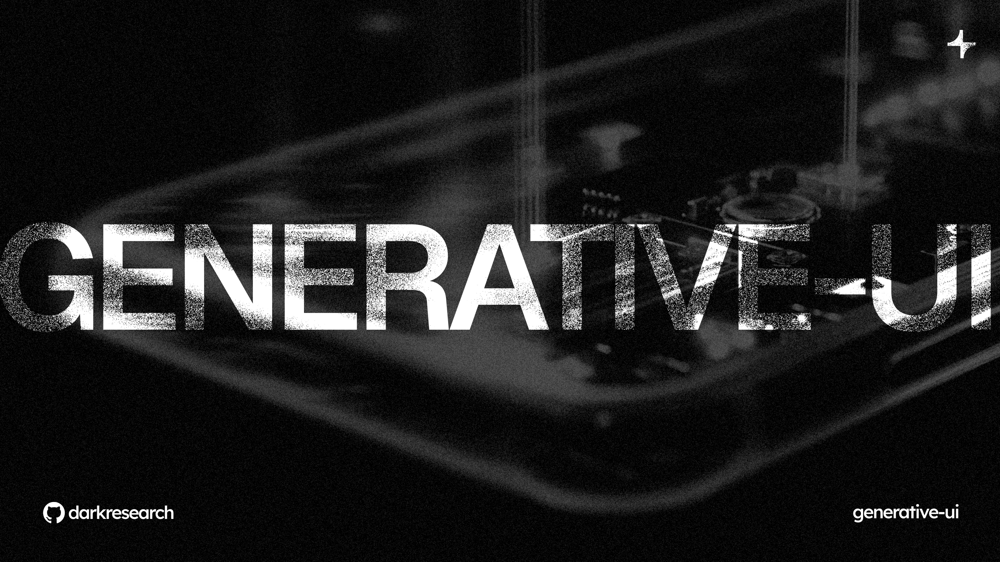

# Generative UI

[](https://www.npmjs.com/package/streamdown-rn)
[](LICENSE)

Tools and templates for building generative UI applications. Mobile-first, optimized for Expo.

## Packages

### [streamdown-rn](./packages/streamdown-rn)

High-performance streaming markdown renderer with dynamic component injection.

- Streaming-first rendering
- Format-as-you-type UX
- Progressive component streaming with skeletons
- Full GFM support (tables, strikethrough, task lists)
- Built-in XSS protection

### [galerie-rn](./packages/galerie-rn) (Experimental)

2D generative UI canvas infrastructure. Currently a stub for future development.

## Apps

- **[apps/debugger](./apps/debugger)** — Web-based streamdown-rn debugger with streaming controls
- **[apps/debugger-ios](./apps/debugger-ios)** — iOS companion for real-device testing
- **[apps/starter](./apps/starter)** — Starter template for new apps

## Quick Start

### Install Streamdown

```bash
npm install streamdown-rn
# or
bun add streamdown-rn
```

```tsx
import { StreamdownRN } from 'streamdown-rn';

function ChatMessage({ content }: { content: string }) {
  return (
    <StreamdownRN theme="dark">
      {content}
    </StreamdownRN>
  );
}
```

### Running the Debuggers

#### Web Debugger (Port 8081)

```bash
cd apps/debugger
bun install
bun run dev:web    # Starts WebSocket server + Expo web
```

Open http://localhost:8081 to access the debugger.

#### iOS Debugger (Port 8082)

The iOS debugger connects to the web debugger via WebSocket to receive streamed content.

```bash
cd apps/debugger-ios
bun install

# First time setup
cd ios && pod install && cd ..

# Run the app
bun run dev    # Starts Metro on 8082 + builds iOS app
```

> **Note:** Make sure the web debugger is running first (`bun run dev:web` in apps/debugger) — the iOS app connects to its WebSocket server.

## Development

### Install Dependencies
```bash
bun install
```

### Build Packages
```bash
bun run build
```

### Run Tests
```bash
bun test
```

### Type Check
```bash
bun run type-check
```

## Architecture

```
generative-ui/
├── apps/
│   ├── debugger/           # Web debugger (port 8081)
│   ├── debugger-ios/       # iOS debugger (port 8082)
│   └── starter/            # Starter template
├── packages/
│   ├── streamdown-rn/      # Streaming markdown renderer
│   ├── galerie-rn/         # Canvas management (experimental)
│   └── debug-components/   # Shared debug components
└── AGENTS.md               # AI development workflow
```

## AI-Assisted Development

This monorepo is optimized for AI-assisted development. See **[AGENTS.md](./AGENTS.md)** for the AI development workflow and guidelines.

---

## Star History

[](https://star-history.com/#darkresearch/generative-ui&Date)

---

Built with ❤️ by [Dark](https://darkresearch.ai)
